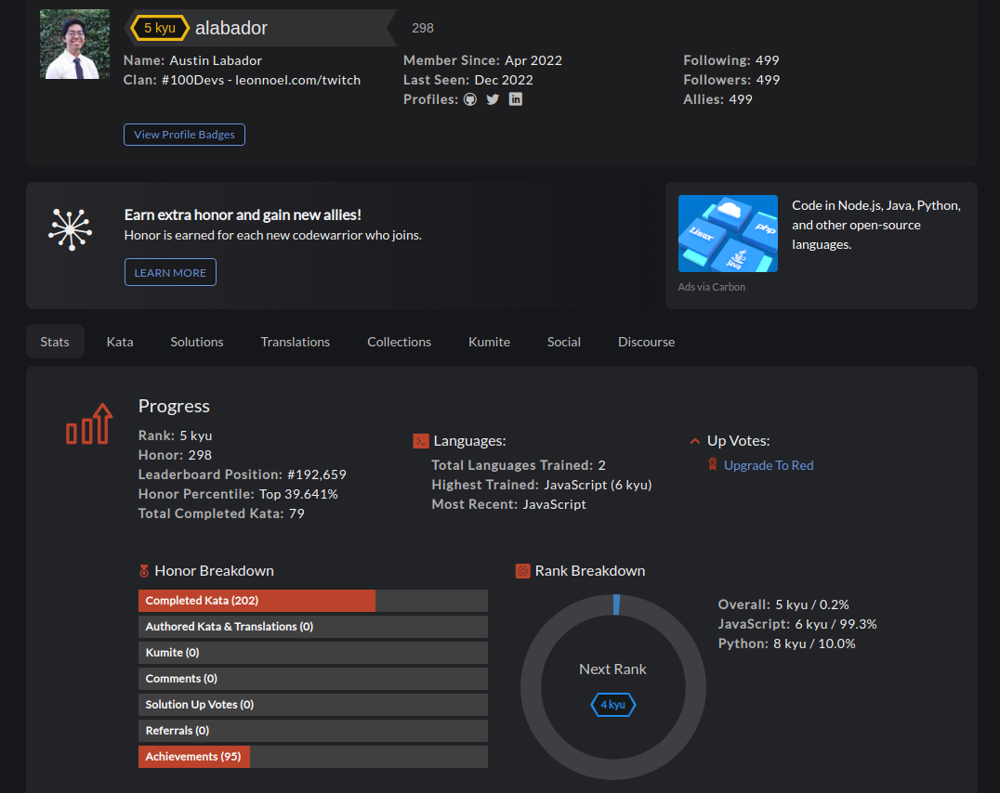

# Codewars Challenges

A repo with my solutions to codewars challenges. 

View Codewars stats [here](https://www.codewars.com/users/alabador), or click on the badge below.

## How It's Made

**Tech used:** JavaScript

My goal is to practice at least one Codewar Kata a day, in order to keep my programming skills sharp. 

## Optimizations

First, I try to make the solution work. Then I try to refactor for readability and efficiency when possible. Definitely a lot of googling is involved, but discussing solutions with others and seeing how they optimized their solutions is a big help.

## Lessons Learned
One of the biggest lesssons I've learned is to be consistent, and try to learn something new everyday, no matter how small. When you look back, you'll see how far you've come. 